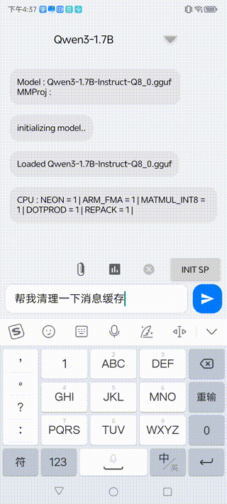
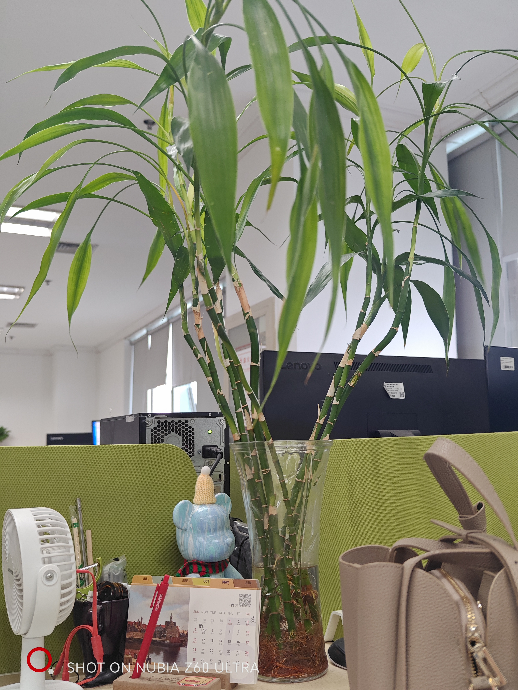
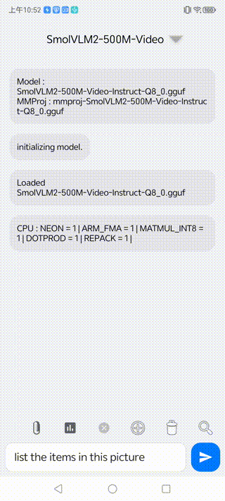
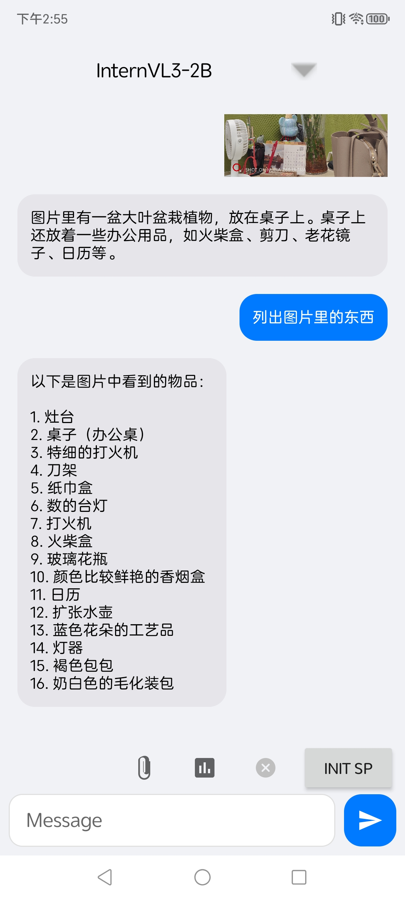
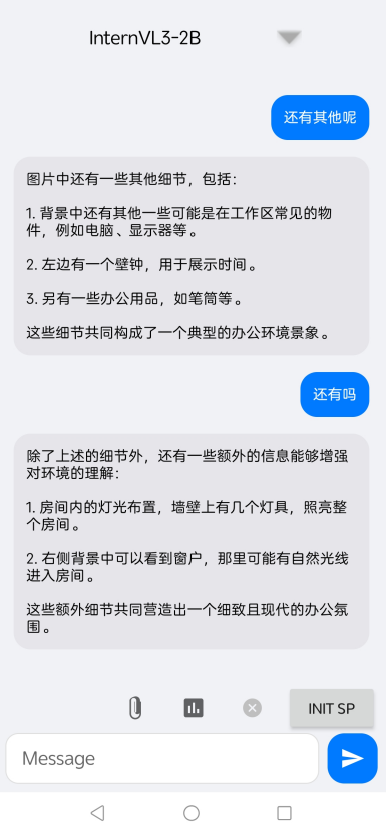
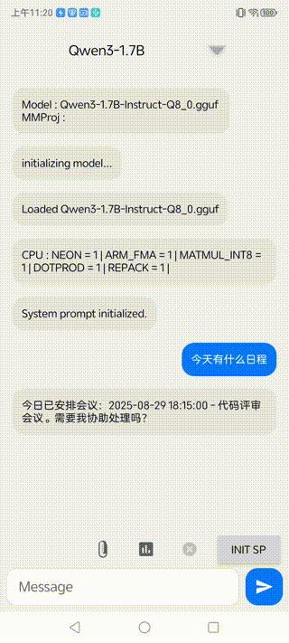
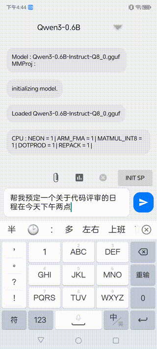

# 模型量化实习工作

## 1. 移动端基础开发

1. llama.cpp 移动平台编译部署（ndk交叉预编译）
2. kv管理
3. 模型加载管理
4. pp和tg等模型交互api开发

### Demo演示


官方示例内使用的很多common系列函数已经废弃，且编译好后的install dir内缺失common静态库，加之官方示例的android项目每次运行都得去根项目编译

基于最新版本的llama.cpp预编译了动态库和静态库（ndk的工具链），方便快捷启用的普通JNI项目，模型文件放置在assets内

少数设备（snapdragon 8gen3 & elite）支持openCL，已开启openCL支持，具体offload层数需要根据模型实际确定


多模态示例：


Agent/Mcp示例




### DemoLLM项目内容

本体用jetPackCompose做的很多版本不适配，DemoLLM是适配老版本项目的无compose模块，美化了界面，增加了模型选择，更详细的baseModel和mmproj的日志包含：

+ 图片上传
+ 多模态支持
+ Benchmark
+ 模型选择
+ kv历史管理
+ 内置提示词模版
+ 模型下载
+ Agent+MCP接口调用
+ ThinkTag
+ 模型采样器设置

## 2. openCL 模型推理加速

### GPU-openCL

jniLibs/arm64-v8a/cpu 该目录下的是基于NDK的纯cpu版本的链接库，上级目录下的是支持openCL的链接库，支持 OpenCL backend

### 推理速度

##### 环境

+ 型号: 努比亚Z60 Ultra
+ SOC: 骁龙8Gen3 3.3GHZ 
+ GPU: 高通 Adreno 750
+ OS驱动: OpenCL 3.0 QUALCOMM build
+ Layers: 28
+ Mutimodal: OFF

#### BenchMark

##### 1. 量化: Q8_0

+ 模型: qwen2.5-1.5B-instruct_Q8_0
+ pp: 64
+ tg: 32
+ nr: 3

> ngl: n_gpu_layers

| ngl     | pp (tps) | tg (tps) | warmup (s) |
|---------|----------|----------|------------|
| 0       | 75       | 49       | 2.22       |
| 5       | 79       | 31       | 4          |
| 10      | 71       | 19       | 5.6        |
| 15      | 62       | 12       | 9          |
| 20      | 28       | 9        | 11         |
| 25      | 24       | 7        | 13         |
| 28(MAX) | 22       | 5        | 18         |


##### 2. 量化: Q4_K_M

+ 模型: Qwen3-1.7B-Q4_K_M
+ pp: 64
+ tg: 32
+ nr: 3

| ngl     | pp (tps) | tg (tps) | warmup (s) |
|---------|----------|----------|------------|
| 0       | 89       | 42       | 2.6        |
| 5       | 48       | 21       | 5.2        |
| 10      | 41       | 12       | 8.5        |
| 15      | 32       | 8.9      | 11.8       |
| 20      | 24       | 6.4      | 16.2       |
| 25      | 24       | 5.6      | 18.6       |
| 28(MAX) | 19       | 5.1      | 20.62      |

##### 3. 量化: Q4_0

+ 模型: Qwen3-1.7B-Q4_0
+ pp: 64
+ tg: 32
+ nr: 3

| ngl     | pp (tps) | tg (tps) | warmup (s) |
|---------|----------|----------|------------|
| 0       | 240      | 50       | 2.1        |
| 5       | 140      | 23       | 4.31       |
| 10      | 93       | 12       | 8.1        |
| 15      | 73       | 8.5      | 11.79      |
| 20      | 62       | 6.6      | 15         |
| 25      | 52       | 5.3      | 20.6       |
| 28(MAX) | 51       | 4.3      | 22.94      |


#### 注意

> Vulkan usually slower than CPU.
>
> OpenCl only work with Snapdragon 8 Gen 3 and Snapdragon 8 Elite .

1. `OpenCL` 目前只支持 `f32`、`f16`、`q6_K` 和 `q4_0`，特别对于`Qwen`系列模型，它的 `q4_K` 和 `q5_K` 张量需要在 `CPU` 上运行，也不支持 `MoE` 模型，所有张量仍会存储在 `CPU` 中。

2. `即使是q4_0`，实际在 `openCL` 后端下测试的性能随着 `offload` 到 `GPU` 的层数变多，性能更差且手机更容易发烫。


## 3. mtmd库 多模态（视觉）支持

### 环境

+ 型号: 努比亚Z60 Ultra
+ SOC: 骁龙8Gen3 3.3GHZ 
+ GPU: 高通 Adreno 750
+ OS驱动: OpenCL 3.0 QUALCOMM build
+ Layers: 28
+ Mutimodal: OFF

llama.cpp相关开发文档太少了，只能看源码，且api较为混乱多样，基于`mtmd-cli`的源码内容修改`completion-init`

原生Api的一些使用特性和注意事项在代码里标注了

### 测试样例



样例




### 存在的问题     

#### 1. 多模态小模型历史任务记忆会影响当前任务 + 不同提示词极大影响识别效果


#### 2. 不同采样器设置下效果差异极大

|采样器设置|样例|
|----|----|
|MinP：（0，1）Temp：0.6 TopK：20 TopP：（0.95f，1）||
|Greedy||

#### 3. 多次提问模型根据历史记忆可获取更多信息，但是多次之后模型有一定概率出现幻觉




### 使用体验


不同尺寸图片的推理速度差异和结果体验

| model name    | quantization | model size   | mmproj size | picture(10k) | picture(100k) | picture(300k) | picture(3M) | summary           |
|---------------|--------------|--------------|-------------|--------------|---------------|---------------|-------------|-------------------|
| SmolVLM2-500M | Q8_0         | 0.4B (0.41G) | 103M        | 1.47s        | 1.48s         | 1.41s         | 1.43s       | 英文效果不错但无中文支持      |
| InternVL3-2B  | Q8_0         | 1.78B (1.8G) | 321M        | 7.39s        | 7.28s         | 6.43s         | 7.61s       | 可用，能满足大部分非专业场景    |
| Qwen2.5-VL-3B | Q4_0         | 3.09B (1.7G) | 805M        | 3.46s        | 42.59s        | 49.81s        | 112.43s     | 物体识别效果非常不错        |
| Gemma3-4B     | Q4_K_M       | 4B (2.4G)    | 812M        | 76.28s       | 124.09s       | 130.39s       | 134.75s     | 识别准确，速度极慢，3次手机就发烫 |


模型参数变大，消耗推理时间和计算资源也指数上升，实际体验感觉`InternVL3-2B`足够用了

### 结论

1. OpenCL 目前只支持 f32、f16、q6_K 和 q4_0，特别对于Qwen系列模型，它的 q4_K 和 q5_K 张量需要在 CPU 上运行，也不支持 MoE 模型，所有张量仍会存储在CPU中。
2. 骁龙8gen3 量化q4_0，实际在openCL后端下测试的性能随着offload到GPU的层数变多，性能更差且设备更容易发烫触发热节流。
3. 多模态超过2B的稍大模型识别速度较慢，适合小图片识别
4. 多模态1.5B左右的模型图形识别能力足够满足非专业领域下大多数场景的主体物体识别功能
5. 多模态kv记忆严重影响当前视觉任务，但是失去记忆无法后续根据视觉任务继续提问
6. 多模态任务需要针对不同模型设置最佳提示词和采样器


## 4. 量化

模型来自hf的fp16版本和本地lora微调后的合并模型，在本机进行gguf格式转换和量化

量化四种方法：

+ 朴素方法
+ k-quants量化
+ i-quants量化
+ 三元量化

测试数据为few-shot场景提示词+所有工具描述信息文本

system_info: 

n_threads = 3 (n_threads_batch = 3) / 6 

CPU : SSE3 = 1 | SSSE3 = 1 | AVX = 1 | AVX2 = 1 | F16C = 1 | FMA = 1 | BMI2 = 1 | AVX512 = 1 | AVX512_VBMI = 1 | AVX512_VNNI = 1 | LLAMAFILE = 1 | OPENMP = 1 | REPACK = 1 |

设备适用模型ppl

|model|params|type|size|ppl|
|-----|------|----|----|---|
|gemma-3-1b|1B|Q8_0|1013.54 MiB|23.9791 +/- 3.71056|
|gemma-3-4b-it|3.88 B|Q4_K_M|2.31 GiB|PPL = 12.0693 +/- 1.61016|
|gemma-3-270m-Instruct|268.10 M|-Q8_0|271.81 MiB|40.5262 +/- 6.95850|
|gemma-3n-E2B-it|4.46 B|IQ4_XS|2.70 GiB|23.7096 +/- 4.27277|
|Qwen2.5-VL-3B-Instruct|3.09 B|Q4_K_M|1.79 GiB|8.5538 +/- 0.73166|
|InternVL3-2B-Instruct|1.78 B|Q8_0|1.76 GiB|8.1897 +/- 0.71310|
|Llama-3.2-1B-Instruct|1.24 B|Q4_0|729.75 MiB|11.8168 +/- 1.38872|
|SmolVLM-256M-Instruct|162.97 M|Q8_0|165.24 MiB|19.0869 +/- 2.45214|
|SmolVLM2-500M-Video-Instruct|409.25 M|Q8_0|414.86 MiB|12.3868 +/- 1.44148|
|qwen2.5-1.5b-instruct|1.78 B|Q8_0|1.76 GiB|8.0244 +/- 0.68040|
|Qwen2.5-Omni-3B|3.40 B|Q8_0|3.36 GiB|7.3679 +/- 0.61788|
|Qwen2.5-VL-3B-Instruct|3.09 B|Q4_0|1.70 GiB|8.9538 +/- 0.77186|
|Qwen2.5-VL-3B-Instruct|3.09 B|Q8_0|3.05 GiB|8.7017 +/- 0.75286|
|Qwen3-0.6B|751.63 M|Q8_0|761.80 MiB|16.2468 +/- 1.83402|
|qwen3_1.7b|2.03 B|tq1_0|700.0 MiB|/|
|qwen3_1.7b|2.03 B|tq2_0|763.0 MiB|/|
|qwen3_1.7b|2.03 B|Q4_0|1005.6 MiB|20.9941 +/- 3.15524|
|Qwen3-1.7B|2.03 B|Q4_K_M|1.19 GiB|19.1113 +/- 2.72726|
|Qwen3-1.7B|2.03 B|Q8_0|2.01|15.6347 +/- 2.11321|
|Qwen3-1.7B|2.03 B|f16|3.78 GiB|15.5588 +/- 2.10436|


最后从中文支持，存储大小，设备功耗，实际工具调用体验，推理速度等方面出发，从`Gemma3`,`Gemma3n`,`SmolVLM`,`InternVL`,`Qwen2`,`Qwen3`等各系列模型中挑选出`Qwen3-1.7B`作为基础模型综合考虑部署的量化版本

## 5. Agent/MCP开发

+ client和server接口开发
+ 提示词，工具描述


### 环境

+ 型号: 努比亚Z60 Ultra
+ SOC: 骁龙8Gen3 3.3GHZ 
+ GPU:  Adreno 750
+ 驱动: OpenCL 3.0 QUALCOMM build
+ Layers: 28
+ Mutimodal: OFF

### 初始PP阶段系统提示词

```
You are a capable AI assistant. Your task is to determine the
    user's intent. Only when the user's intent clearly matches one of the available
    tools listed below should you generate a JSON object for a tool call. For all 
    other cases—including but not limited to casual conversation, greetings, jokes,
    or any request unrelated to the tool functions—you must respond directly in 
    natural language and must not generate any JSON.

    When you decide to call a tool, please output a JSON object strictly following 
    the MCP protocol. Do not add any extra text before or after the JSON.
    --- Example begins ---
    Example 1: Need to call a tool
    User question: "Help me check today's schedule"
    Your answer: {"tool_name": "get_calendar_events", "arguments": {"date": "2025-08-28"}}

    Example 2: No need to call a tool
    User question: "Hello there"
    Your answer: "Hello! How can I help you?"

    Example 3: Need to call a tool  
    User question: "Create a schedule, meeting at 3 PM tomorrow"
    Your answer:  {"tool_name": "create_calendar_event", "arguments": {"title": "meeting about ", "start_time": "2025-08-08T15:00:00"}}

    Example 4: No need to call a tool
    User question: "What do you think of the weather today?"
    Your answer: "Sorry, I can't fetch weather information, but I can help you manage your schedule."
    --- End of example ---
     The list of available tools is as follows:
```
### 初始PP阶段工具描述

调用接口获取描述

```
[
    {
"tool_name": "clear_all_cache",
"tool_description": "Clear all caches of the application, including system cache, message cache, and mini-program cache.",
"arguments": {}
},
{
      "tool_name": "clear_message_cache",
      "tool_description": "Clear all caches in the message module, mainly including chat attachments such as images, videos, files, etc.",
      "arguments": {}
    },
    {
      "tool_name": "clear_miniprogram_cache",
      "tool_description": "Clear the cache files of all installed mini programs.",
      "arguments": {}
    },
    {
      "tool_name": "create_calendar_event",
      "tool_description": "Create a new calendar event, meeting, or to-do item.",
      "arguments": {
        "type": "json object",
        "properties": {
          "title": { "type": "string", "description": "title or theme of the event/meeting" },
          "start_time": { "type": "string", "description": "start time of the event。if the user does not provide then ignore this parameter because the create calendar menu will let user choose the time info" }
        },
        "required": ["title"]
      }
    },
    {
      "tool_name": "decrease_font_size",
      "tool_description": "Decrease the font size by one level",
      "arguments": {}
    },
    {
      "tool_name": "get_calendar_events",
      "tool_description": "Query the list of schedules, meetings, or to-do items for a specified date no matter whether if user provide the date info.",
      "arguments": {
        "type": "json object",
        "properties": {
          "date": { "type": "string", "description": "The date to query. If the user does not provide it, this parameter should be ignored." }
        }
      }
    },
    {
      "tool_name": "increase_font_size",
      "tool_description": "Increase the font size by one level",
      "arguments": {}
    },
    {
      "tool_name": "set_font_size",
      "tool_description": "Open the font size settings page",
      "arguments": {}
    }
]
```

100次工具平均调用测试

|model|type|result|日程示例|
|----|-----|-----|-----|
|Gemma3-270m|Q8_0|效果和执行差，通常调用命令无法解析|/|
|SmolVLM2-500M|Q8_0|效果和执行差，通常调用命令无法解析|/|
|InternVL3-2B|Q8_0|概率命令执行失败，模型容易出现复读和幻觉||
|Qwen3-0.6B|Q8_0|概率执行失败，模型过小，存在输出中断的问题，在正常思考流程中概率输出EOS||
|Qwen3-1.7B|Q4_0|测试过程中未出现过失败，但是思考耗时较长||


处理性能

+ system prompt pp：系统提示词初始化耗时
+ response time：生成响应结束总耗时
+ load time：模型加载耗时

|model|load time(s)|pp(s)|response time(s)|success rate|
|----|-----|-----|-----|-----|
|Gemma3-270m|0.76|0.05|1.87|0%|
|SmolVLM2-500M|0.74|16.93|15.41|0%|
|InternVL3-2B|2.05|31.8|9.53|64%|
|Qwen3-0.6B（think model open）|1.56|17.38|22.57|32%|
|Qwen3-1.7B（think model open）|2.61|16.72|57.34|94%|

## 6. 模型微调

### 网络流量分析攻击类型判断

base模型：Gemma3-270m-it

轻量，高速，通用场景下不错的体验。但是本测试中在各种中/英提示词场景下识别任务的能力都十分低下，基本无法使用

一些场景下的表现

|model|0-shot|5-shot|10-shot|20-shot|30-shot|
|----|-----|-----|-----|-----|-----|
|Gemma3-270m|accuracy         0.100000 <br> macro avg        0.017212 <br>weighted avg     0.020482  |accuracy         0.160000<br>macro avg        0.168695  <br> weighted avg     0.167199 |accuracy         0.290000 <br> macro avg        0.263372 <br> weighted avg     0.251346 |accuracy         0.250000 <br>macro avg        0.213632 <br> weighted avg     0.208413 |accuracy         0.250000  <br> macro avg        0.215873  <br> weighted avg     0.211222  |

基本配置：

+ TRAIN_BATCH_SIZE = 16
+ EVAL_BATCH_SIZE = 24
+ GRAD_ACCUMULATION_STEPS = 2
+ NUM_TRAIN_EPOCHS = 3
+ LEARNING_RATE = 2e-4

Lora配置

+  LORA_R = 8
+  LORA_ALPHA = 16
+  LORA_TARGET_MODULES = ["q_proj", "v_proj"]
+  LORA_DROPOUT = 0.1


### MCP/本地工具调用

