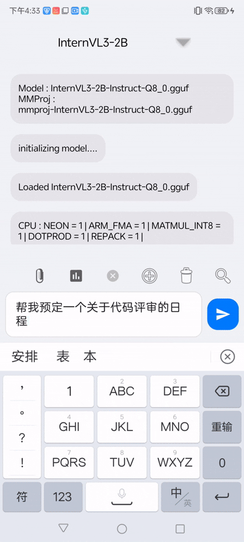
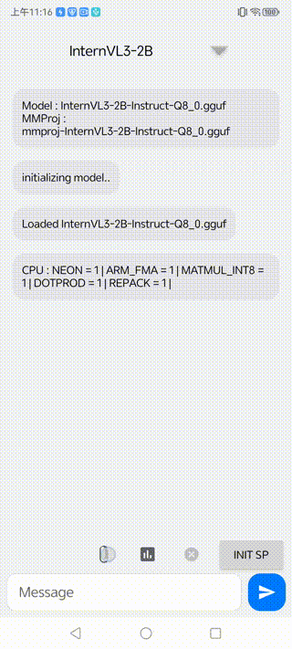

# BG

示例按照官方的llama.android，官方示例内使用的很多common函数已经废弃，且编译好后的install dir内缺失common静态库，加之官方示例的android项目每次运行都得去根项目编译

基于最新版本的llama.cpp预编译了动态库和静态库（ndk的工具链），方便快捷启用的普通JNI项目，模型文件放置在assets内

少数设备（snapdragon 8gen3 & elite）支持openCL，已开启openCL支持，具体offload层数需要根据模型实际确定

# 任务

1. 模型加速推理
2. 多模态（视觉）支持
3. MCP接口支持
4. 微调模型增加效率

MCP接口调用示例：

多模态示例：

# DemoLLM

本体用jetPackCompose做的很多版本不适配，DemoLLM是适配老版本项目的无compose模块，美化了界面，增加了模型选择，更详细的baseModel和mmproj的日志包含：

+ 图片上传
+ 多模态支持
+ Benchmark
+ 模型选择
+ kv历史管理
+ 内置提示词模版
+ 模型下载（开发中）

# GPU-openCL

jniLibs/arm64-v8a/cpu 该目录下的是基于NDK的纯cpu版本的链接库，上级目录下的是支持openCL的链接库，支持 OpenCL backend

## 推理速度实测

### 环境

+ 型号: 努比亚Z60 Ultra
+ SOC: 骁龙8Gen3 3.3GHZ 
+ GPU: 高通 Adreno 750
+ OS驱动: openCL
+ Layers: 28
+ Mutimodal: OFF

### 测速结果

#### 1. 量化: Q8_0

+ 模型: qwen2.5-1.5B-instruct_Q8_0
+ pp: 64
+ tg: 32
+ nr: 3

> ngl: n_gpu_layers

| ngl     | pp (tps) | tg (tps) | warmup (s) |
|---------|----------|----------|------------|
| 0       | 75       | 49       | 2.22       |
| 5       | 79       | 31       | 4          |
| 10      | 71       | 19       | 5.6        |
| 15      | 62       | 12       | 9          |
| 20      | 28       | 9        | 11         |
| 25      | 24       | 7        | 13         |
| 28(MAX) | 22       | 5        | 18         |

#### 2. 量化: Q4_K_M

+ 模型: Qwen3-1.7B-Q4_K_M
+ pp: 64
+ tg: 32
+ nr: 3

| ngl     | pp (tps) | tg (tps) | warmup (s) |
|---------|----------|----------|------------|
| 0       | 89       | 42       | 2.6        |
| 5       | 48       | 21       | 5.2        |
| 10      | 41       | 12       | 8.5        |
| 15      | 32       | 8.9      | 11.8       |
| 20      | 24       | 6.4      | 16.2       |
| 25      | 24       | 5.6      | 18.6       |
| 28(MAX) | 19       | 5.1      | 20.62      |

#### 3. 量化: Q4_0

+ 模型: Qwen3-1.7B-Q4_0
+ pp: 64
+ tg: 32
+ nr: 3

| ngl     | pp (tps) | tg (tps) | warmup (s) |
|---------|----------|----------|------------|
| 0       | 240      | 50       | 2.1        |
| 5       | 140      | 23       | 4.31       |
| 10      | 93       | 12       | 8.1        |
| 15      | 73       | 8.5      | 11.79      |
| 20      | 62       | 6.6      | 15         |
| 25      | 52       | 5.3      | 20.6       |
| 28(MAX) | 51       | 4.3      | 22.94      |

# 会话管理

单轮最大生成长度 nlen

上下文最大长度的限制比较简单，超出就直接清空kv历史缓存，应该清除最老的kv缓存

# 多模态

llama.cpp相关开发文档太少了，只能看源码，且api较为混乱多样，基于`mtmd-cli`的源码内容修改`completion-init`

原生Api的一些使用特性和注意事项在代码里标注了

## 使用体验

尝试了不同尺寸的一些模型，差异较大。

测试了在CPU(baseModel+mmprojModel) 下，不同尺寸图片的推理速度差异和结果体验

| model name    | quantization | model size   | mmproj size | picture(10k) | picture(100k) | picture(300k) | picture(3M) | feeling           |
|---------------|--------------|--------------|-------------|--------------|---------------|---------------|-------------|-------------------|
| SmolVLM2-500M | Q8_0         | 0.4B (0.41G) | 103M        | 1.47s        | 1.48s         | 1.41s         | 1.43s       | 英文效果不错但无中文支持      |
| InternVL3-2B  | Q8_0         | 1.78B (1.8G) | 321M        | 7.39s        | 7.28s         | 6.43s         | 7.61s       | 可用，能满足大部分非专业场景    |
| Qwen2.5-VL-3B | Q4_0         | 3.09B (1.7G) | 805M        | 3.46s        | 42.59s        | 49.81s        | 112.43s     | 物体识别效果非常不错        |
| Gemma3-4B     | Q4_K_M       | 4B (2.4G)    | 812M        | 76.28s       | 124.09s       | 130.39s       | 134.75s     | 识别准确，速度极慢，3次手机就发烫 |

模型参数变大，消耗推理时间和计算资源也指数上升，实际体验感觉`InternVL3-2B`足够用了

# 注意

> Vulkan usually slower than CPU.
>
> OpenCl only work with Snapdragon 8 Gen 3 and Snapdragon 8 Elite .

1. `OpenCL` 目前只支持 `f32`、`f16`、`q6_K` 和 `q4_0`，特别对于`Qwen`系列模型，它的 `q4_K` 和 `q5_K` 张量需要在 `CPU` 上运行，也不支持 `MoE` 模型，所有张量仍会存储在 `CPU` 中。

2. `即使是q4_0`，实际在 `openCL` 后端下测试的性能随着 `offload` 到 `GPU` 的层数变多，性能更差且手机更容易发烫。
